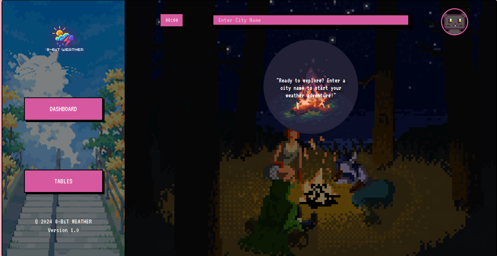
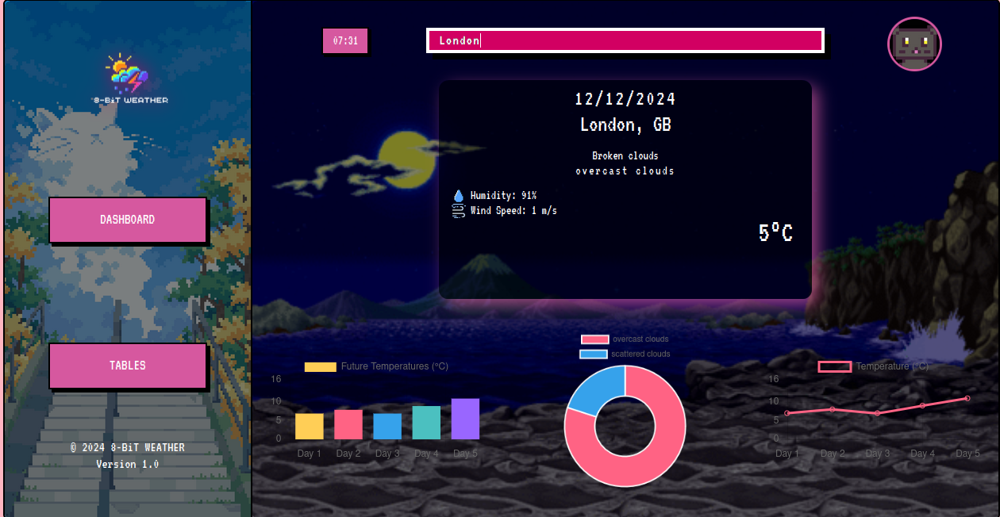
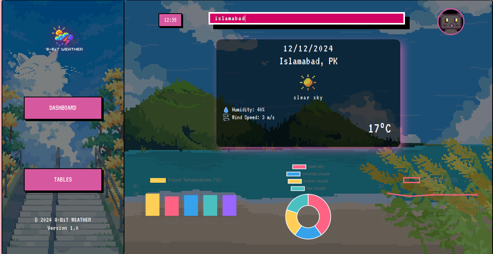
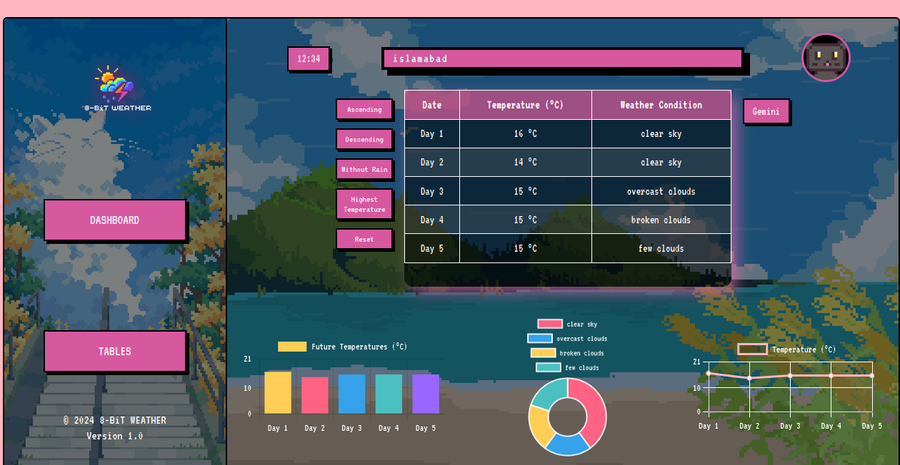
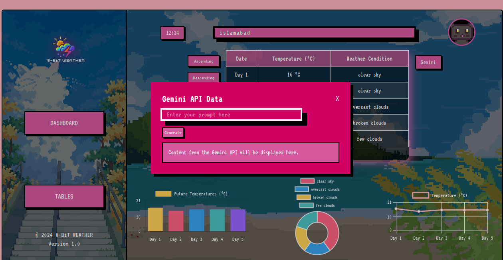

# Weather Application

## Overview

This Weather Application displays weather forecasts and related data for specified cities. It utilizes vanilla HTMl,CSS and JS.
It uses OpenWeatherApi to fetch the forecast.
JS charts to visualize the data.
Gemini 1.5 used as chatbot to ask details about the tables.

## Features

- **Search for Cities**: Users can enter a city name to retrieve weather data.
- **Weather Forecast Table**: Displays a detailed 5-day weather forecast.
- **Dynamic Charts**: Visual representation of temperature and weather conditions (can be toggled on/off).

## Technologies Used

- **Backend**: Javascript
- **Frontend**: HTML,CSS,Chart.js
- **Data Source**: [OpenWeatherMap API](https://openweathermap.org/api)

## Deployment

The project is deployed on Vercel and can be accessed from there or local machine

## Dashboard

## Dynamic background change based on weather

## Current Weather Forecaset at 12:00

## Weather Tables showcases forecast for next 5 days

## Gemini chatbot

